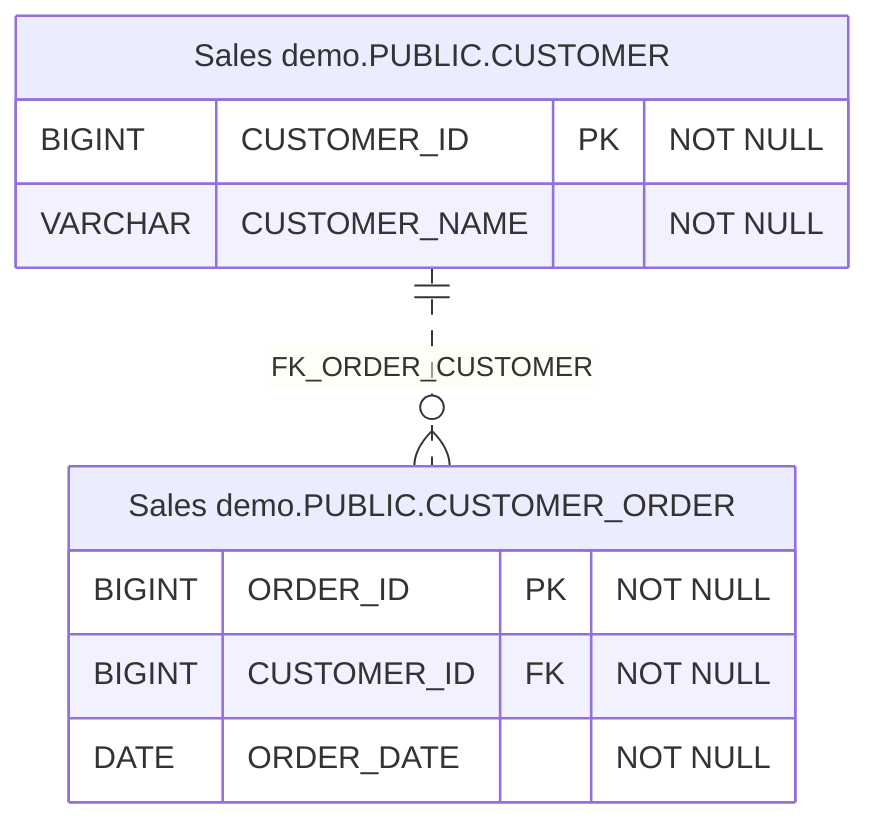

# sqlapp

sqlapp helps Java teams understand a database, review schema changes, and move
related data with verification. It connects these workflows through one shared
Schema model, with Java APIs and the `com.sqlapp.db` Gradle plugin.

## What you can do

| Your goal | What you get | Start here |
|---|---|---|
| Understand and share an existing database | A saved Schema XML snapshot, browsable HTML, clickable ER diagrams, and table DDL | [Generate database documentation](docs/getting-started/use-cases.md#understand-and-share-a-database) |
| Review and manage schema changes | Snapshot comparisons, database-specific change SQL, and versioned SQL migration tasks | [Review a schema change](docs/getting-started/use-cases.md#review-and-manage-schema-changes) |
| Move related data and check the result | Dependency-ordered migration, optional resume, row/hash verification, and reviewable repair plans | [Move and verify data](docs/getting-started/use-cases.md#move-related-data-and-verify-it) |

## Why use sqlapp

- **Reuse the same database representation.** Metadata readers, SQL generation,
  documentation, and migration consume the shared Schema model. Capture a
  snapshot once and use it to generate documentation and SQL without reconnecting
  to the source database.
- **Make database work repeatable.** Use Gradle tasks in a build or embed Java
  APIs in your own tool. Keep Schema XML, generated SQL, and configured reports
  as reviewable artifacts alongside the workflow that produced them.
- **Keep migration outcomes visible.** Detailed plans, checkpoints, verification
  results, and optional execution reports expose what completed and what needs
  attention. Resume and approved repair are available when explicitly configured.

Database support and transaction guarantees depend on the dialect and workflow.
See the [compatibility evidence](docs/compatibility.md) and
[use-case guide](docs/getting-started/use-cases.md) for boundaries and examples.

## See the outputs

These previews are generated by the customer/order demos using fictional data
and HSQLDB. They show the output format; database support varies by dialect.

**Understand the structure.** The generated Mermaid diagram shows the foreign
key between customers and orders. The HTML documentation also includes a
clickable SVG diagram, table details, and DDL.

<!-- demo-preview:diagram:start -->



<!-- demo-preview:diagram:end -->

**Review a change.** Adding a nullable email column produces this change SQL.
The demo generates it for review without executing it.

<!-- demo-preview:sql:start -->

```sql
-- Generated HSQL change SQL for review; not executed.
ALTER TABLE PUBLIC.CUSTOMER ADD COLUMN EMAIL VARCHAR(254);
```

<!-- demo-preview:sql:end -->

**Check transferred data.** The migration first matches, then detects a changed
customer name even though row counts stay the same. No repair is executed.

<!-- demo-preview:migration:start -->

```text
Initial migration: MATCH; 2 tables; 5 source rows; 5 target rows
After changing CUSTOMER name: MISMATCH; 1 table; 5 source rows; 5 target rows
Detection uses ordered row hashes as well as counts. No repair was executed.
```

<!-- demo-preview:migration:end -->

The [diagram source](docs/examples/previews/customer-order.mmd),
[change SQL](docs/examples/previews/change.sql), and
[migration summary](docs/examples/previews/migration-summary.txt) are saved as
text files. Run the tour below to browse the full HTML and JSON reports.

## Try sqlapp

Run all three customer/order demos from this repository with Java 21:

```shell
./gradlew --init-script docs/examples/offline-html/demo.init.gradle demoSqlapp
```

Open `build/docs/demo/index.html` to browse the generated HTML and ER diagram,
compare a schema change with its SQL, and inspect a real migration verification
and deliberately detected mismatch. No external database is required.

On Windows, use `.\gradlew.bat` in place of `./gradlew`. See the
[guided demo tour](docs/getting-started/demo-tour.md) for dependencies, individual
demos, and how to read the results.

For your own database, follow the quick start below: export metadata, generate the
HTML site, and open its `index.html`. For an existing Schema XML file, the
[HTML-only workflow](docs/gradle-plugin/getting-started.md#3-generate-html-from-the-xml)
needs no database connection.

## More ways to use the same model

| When you need to... | sqlapp provides | Guide |
|---|---|---|
| Port parent/child business processing to Java | Record-oriented loops with grouped child reads, buffered writes, and execution results | [Hierarchical processing](docs/getting-started/use-cases.md#process-parent-and-child-records-together) |
| Evaluate an Access replacement before loading data | Offline assessment, reviewed target mappings, and DDL verification for supported Oracle/SQL Server targets | [Migration assessment](docs/gradle-plugin/database-migration-assessment.md) |
| Extract and reshape legacy data | Normalization planning, PL/I import, extraction contracts, and hierarchy loading | [Legacy workflows](docs/gradle-plugin/normalization-and-legacy-migration.md) |
| Exchange data files or prepare test data | Import/export, format conversion, and relational test-data task types | [Data task guide](docs/gradle-plugin/custom-tasks-and-migrations.md) |
| Make a large schema easier to discuss | Logical names, virtual foreign keys, and named table viewpoints | [HTML and ER documentation](docs/schema/html-documentation.md#viewpoints-and-dictionaries) |

See [how the workflows fit together](docs/getting-started/use-cases.md#choose-the-operation-you-actually-need)
before selecting advanced migration options.

## Requirements

- Java 21
- A JDBC driver for the database being accessed; declare it explicitly in the
  application so its version remains under application control
- A matching `sqlapp-core-{db}` dialect module for database-specific metadata
  and SQL behavior
- Gradle, preferably through a Gradle Wrapper, when using the Gradle plugin

The JDBC driver and the sqlapp dialect have different roles and are both
needed for JDBC workflows. Some dialect artifacts currently carry a driver as
a runtime dependency, but applications should not rely on that as a stable
driver-version policy. The Gradle plugin does not select a general target
database driver.

## Gradle plugin quick start

The following Groovy DSL example exports PostgreSQL metadata and generates
a browsable database reference. It exports structure only (`dumpRows = false`).
Replace the JDBC driver version and connection values for your environment.

```groovy
plugins {
    id 'java'
    id 'com.sqlapp.db' version '0.80.0'
}

repositories {
    mavenCentral()
}

dependencies {
    runtimeOnly 'com.sqlapp:sqlapp-core-postgres:0.80.0'
    runtimeOnly 'org.postgresql:postgresql:<jdbc-driver-version>'
}

tasks.named('exportSchemaXml') {
    dataSource {
        jdbcUrl = providers.environmentVariable('SQLAPP_JDBC_URL')
        username = providers.environmentVariable('SQLAPP_DB_USER')
        password = providers.environmentVariable('SQLAPP_DB_PASSWORD')
    }
    includeSchemas.add('public')
    target = 'catalog'
    dumpRows = false
    outputDirectory = layout.buildDirectory.dir('schema')
    outputFileName = 'Catalog.xml'
}

tasks.named('generateHtmlDocs') {
    dependsOn(tasks.named('exportSchemaXml'))
    targetFile = layout.buildDirectory.file('schema/Catalog.xml')
    outputDirectory = layout.buildDirectory.dir('docs/database')
}
```

Run it with the project wrapper:

```shell
./gradlew generateHtmlDocs
```

On Windows PowerShell, use `.\gradlew.bat generateHtmlDocs`.
Open `build/docs/database/index.html` to browse tables and their DDL, then use
`relationships.html` for clickable ER diagrams. The metadata snapshot is saved
as `build/schema/Catalog.xml`; keep it to regenerate the site without another
export. Diagram contents depend on the relationships captured in the model.

Credentials should come from environment variables, a local untracked properties
file, or another secret provider; do not commit them to the build script.

Continue with the [Gradle plugin getting-started guide](docs/gradle-plugin/getting-started.md)
to generate HTML documentation and SQL from the saved XML. A complete runnable
configuration is available in
[`sqlapp-gradle-example`](https://github.com/satotatsu/sqlapp-gradle-example).

## Java library dependency

For direct Java API use, add the core model and the dialect needed by the
application. Gradle:

```groovy
dependencies {
    implementation 'com.sqlapp:sqlapp-core:0.80.0'
    runtimeOnly 'com.sqlapp:sqlapp-core-postgres:0.80.0'
    runtimeOnly 'org.postgresql:postgresql:<jdbc-driver-version>'
}
```

Maven:

```xml
<dependencies>
  <dependency>
    <groupId>com.sqlapp</groupId>
    <artifactId>sqlapp-core</artifactId>
    <version>0.80.0</version>
  </dependency>
  <dependency>
    <groupId>com.sqlapp</groupId>
    <artifactId>sqlapp-core-postgres</artifactId>
    <version>0.80.0</version>
    <scope>runtime</scope>
  </dependency>
</dependencies>
```

Add the database vendor's JDBC driver separately. Modules are published under
the `com.sqlapp` group. Keep sqlapp module versions aligned unless a release
note explicitly states otherwise.

## Project modules

| Module | Responsibility |
|---|---|
| `sqlapp-core` | Schema model, JDBC foundations, shared metadata and SQL APIs |
| `sqlapp-command` | Documentation, data handling, generation, synchronization, and migration commands |
| `sqlapp-gradle-plugin` | Gradle tasks backed by `sqlapp-command` |
| `sqlapp-core-{db}` | Database-specific metadata readers, dialect resolution, data types, and SQL generation |
| `sqlapp-elk-svg` | Current ELK-based SVG ER diagram rendering |
| `sqlapp-core-test` | Shared test support; not required at application runtime |

The repository currently contains dialect modules for DB2, Firebird,
H2, HSQLDB, Informix, Access/MDB, MariaDB, MySQL, Oracle, Phoenix,
PostgreSQL, AlloyDB / AlloyDB Omni, Aurora PostgreSQL (experimental), SAP HANA, Cloud Spanner, SQLite, SQL Server, Sybase ASE,
Vertica, YugabyteDB YSQL, and CockroachDB. Module presence does not by itself guarantee every feature on
every server version; check the relevant dialect documentation and release
notes before production use.

For AlloyDB / AlloyDB Omni 15–17, see the [usage and verification scope](sqlapp-core-alloydb/README.md).
Managed Google Cloud AlloyDB remains unverified.

For Aurora PostgreSQL 14–17 (experimental; Aurora execution unverified), see the
[usage and verification boundary](sqlapp-core-aurora-postgres/README.md).

For CockroachDB 24.3/25.4, see the [usage, verified scope and limits](sqlapp-core-cockroach/README.md).

For YSQL 11/15, see the [usage, verified scope and limits](sqlapp-core-yugabyte/README.md).

See [Published artifacts and dependency selection](docs/artifacts.md) for the
complete artifact list, common dependency combinations, dialect artifact
names, and current JDBC dependency behavior. See the
[compatibility and verification matrix](docs/compatibility.md) for Java and
Gradle baselines, dialect version boundaries, and real-engine test evidence.

## Documentation

- [Use cases and example outputs](docs/getting-started/use-cases.md): see what each workflow produces.
- [Documentation index](docs/README.md): choose a guide by goal.
- [Gradle plugin](docs/gradle-plugin/README.md): setup, tasks, and workflows.
- [Java API getting started](docs/getting-started/java-api.md): Schema model and SQL APIs.
- [Data movement and migration](docs/migration/README.md): assessment, loading, verification, and recovery.
- [Compatibility](docs/compatibility.md): version boundaries and verification evidence.
- [Building and testing](docs/development/build-and-test.md): contributor setup and validation.

The companion
[`sqlapp-gradle-example`](https://github.com/satotatsu/sqlapp-gradle-example)
contains runnable configurations for schema export, schema comparison, SQL
generation, migrations, HTML documentation, dictionaries, logical foreign
keys, data import/export, format conversion, and test-data generation.

## Building this repository

Use Java 21 and the checked-in wrapper:

```shell
./gradlew build
```

On Windows PowerShell:

```powershell
.\gradlew.bat build
```

Some dialect integration tests require their own database environment and are
not implied by this command. Do not point tests or examples at a production
database.

## Contributing

See [CONTRIBUTING.md](CONTRIBUTING.md) for the repository's development and
testing rules. Bug reports and focused pull requests should include the
affected module, database product and version when relevant, expected behavior,
actual behavior, and a minimal reproduction.

## License

Copyright © 2007–2026 Tatsuo Satoh.

sqlapp is free software licensed under the
[GNU Lesser General Public License, version 3 or later](LICENSE.md). Individual
modules include their license notice and copies of the GNU LGPL and GPL terms.
There is no warranty; see the license terms for details.
