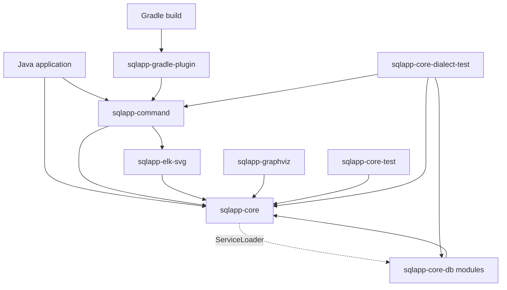
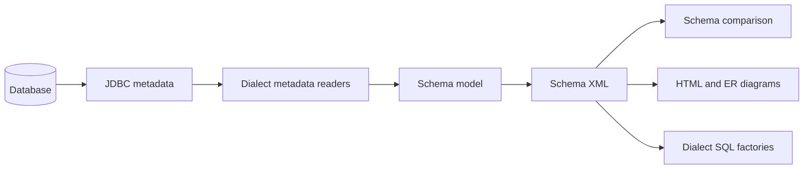
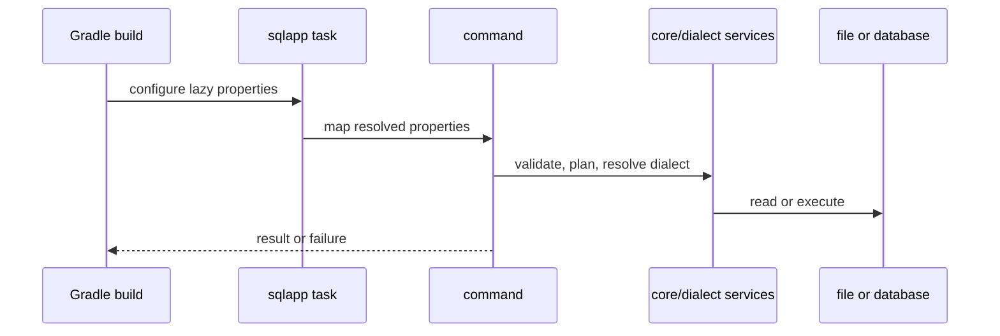
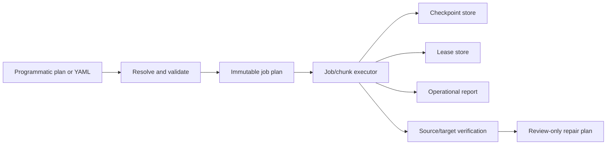

# Architecture

sqlapp is a Java 21 and Gradle multi-project database utility. Its central
design decision is that the shared Schema model represents database structure;
metadata readers populate that model, commands transform or consume it, and
dialects generate database-specific SQL from it.

## Module relationships

Arrows show compile/runtime use, not artifact publication scope. See
[Published artifacts and dependency selection](artifacts.md) for the exact
consumer dependencies.

## `sqlapp-core`

`sqlapp-core` owns shared concepts and extension points:

- the `Catalog`, `Schema`, table, column, constraint, routine, sequence, and
  other database-object models;
- Schema XML reading and writing;
- object comparison, filtering, naming, and conversion;
- common JDBC metadata-reader abstractions;
- SQL operations, builders, factories, and registries;
- dialect resolution contracts;
- bulk INSERT/UPSERT, checkpoint, lease, verification, and snapshot planning
  abstractions that are meaningful across databases.

The core module must not depend on a database-specific module. Cross-database
features belong here only when a common model can represent them without
discarding important meaning.

## Database dialect modules

Each `sqlapp-core-{db}` module owns behavior specific to one database family:

- product-name and version resolution;
- vendor metadata catalogs and readers;
- data types, identifier rules, quoting, and case behavior;
- SQL builders and operation factories;
- version-specific syntax boundaries;
- optimized bulk or set-based migration providers when supported.

Dialect modules register implementations through Java `ServiceLoader`
resources. `DialectResolver` selects a product resolver using JDBC database
metadata, while bulk and set-based resolvers discover provider implementations
through their respective service interfaces.

Newer server versions commonly inherit the nearest compatible implementation
and override only changed metadata or SQL behavior. A fallback to the newest
known dialect is not by itself proof of full compatibility; see the
[compatibility matrix](compatibility.md).

## `sqlapp-command`

`sqlapp-command` contains user workflows and file/configuration handling. It
owns commands for:

- schema export, comparison, synchronization, and SQL generation;
- HTML documentation and dictionaries;
- data import, export, conversion, and test-data generation;
- versioned SQL migration;
- bulk migration job configuration, execution, reports, verification, and
  repair planning;
- type-2 snapshot configuration, approval, execution, and audit reports;
- normalization and legacy-system migration artifacts.

Commands compose the Schema model and core planners/executors. They should not
duplicate database-specific SQL that belongs in a dialect module. Commands
also own YAML, JSON, file-path, encoding, and atomic-artifact behavior that does
not belong in the shared model.

## `sqlapp-gradle-plugin`

The plugin ID `com.sqlapp.db` exposes commands as Gradle tasks. Task classes:

- declare Gradle lazy properties and accurate input/output annotations;
- map task properties into command objects;
- supply the task runtime classpath for dialect and JDBC discovery;
- invoke command behavior without reimplementing it.

Some commands have fixed task names registered by `DbPlugin`; other public
task types are registered by the consuming build under project-specific names.
Task names and properties form a user-facing compatibility surface. See the
[Gradle plugin task guide](gradle-plugin/README.md).

## Diagram rendering

`sqlapp-elk-svg` is the current SVG ER-diagram implementation used by command
and documentation workflows. Layout and SVG rendering belong in this module,
while the tables and relationships being rendered remain Schema model objects.

`sqlapp-graphviz` is the legacy renderer. It remains a separate artifact so
applications using the current ELK path do not need to configure Graphviz.

## Test modules

`sqlapp-core-test` provides reusable test support and depends on the shared
core model. It is intended for test configurations, not application runtime.

`sqlapp-core-dialect-test` assembles dialects, JDBC drivers, commands, and
Testcontainers-based suites for real-engine verification. Its normal `test`
task is disabled; integration coverage is opt-in through `dockerTest`.

## Main data flows

### Metadata, documentation, and SQL

Schema XML is a durable handoff between live metadata access and offline
documentation or SQL generation. A reviewed baseline should be distinct from
a fresh export when generated SQL can change a database.

### Gradle task execution

Validation failures and execution failures propagate to the Gradle build;
tasks must not silently treat partial database work as success.

### Bulk migration

The high-level facade is the common entry point. Optional stores, listeners,
providers, and lifecycle phases support advanced operation without changing
the plan's safety checks. The shared Schema model supplies resolved table and
column identity.

## Configuration ownership

| Concern | Owning module |
|---|---|
| Shared database representation | `sqlapp-core` |
| Generic SQL and migration abstractions | `sqlapp-core` |
| Vendor metadata and SQL | Matching `sqlapp-core-{db}` |
| YAML/JSON/file command configuration | `sqlapp-command` |
| Gradle properties and task registration | `sqlapp-gradle-plugin` |
| ELK layout and SVG output | `sqlapp-elk-svg` |
| Reusable test utilities | `sqlapp-core-test` |
| Real-engine integration suites | `sqlapp-core-dialect-test` |

This ownership keeps the Java API, command layer, and Gradle plugin on the same
validation and execution path.

## Compatibility-sensitive surfaces

Changes to the following require explicit compatibility review and user-facing
documentation:

- public Java APIs and Schema object identity;
- Schema XML representation and defaults;
- dialect resolution and server-version boundaries;
- generated SQL and identifier behavior;
- Gradle task names, property names, types, and conventions;
- YAML and JSON configuration;
- persisted plans, checkpoints, approvals, and reports;
- transaction, retry, lease, and failure semantics.

Persisted migration formats carry explicit versions and reject unsupported
versions. Generated database artifacts should retain resolved identifiers and
fingerprints needed for reproducibility and audit.

## Adding a cross-cutting feature

1. Decide whether the concept has a lossless cross-database representation.
2. Add a shared Schema model or extension point only when multiple dialects can
   use it consistently.
3. Put vendor catalog queries and syntax in the owning dialect.
4. Expose the workflow through a command before adding a thin Gradle task.
5. Test model behavior, SQL/metadata boundaries, command validation, and task
   property mapping at the smallest relevant layer.
6. Document configuration, compatibility, generated formats, and limitations.

Features without an honest shared model remain dialect-specific until their
identity, references, XML round trip, and rename behavior can be designed
consistently.
