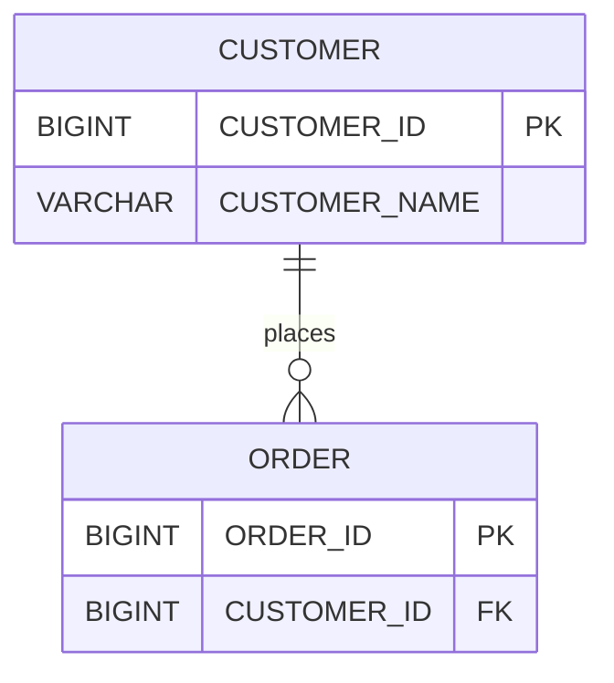

# Choose a sqlapp workflow

[Documentation index](../README.md) · [Getting started](README.md)

Start with the outcome you need. The examples below show representative inputs
and outputs; they are illustrations, not evidence of a run against your database.
The linked guides contain configuration, required dependencies, and limitations.

## On this page

- [Understand and share a database](#understand-and-share-a-database)
- [Review and manage schema changes](#review-and-manage-schema-changes)
- [Move related data and verify it](#move-related-data-and-verify-it)
- [Process parent and child records together](#process-parent-and-child-records-together)
- [Choose the operation you actually need](#choose-the-operation-you-actually-need)
- [Choose an integration](#choose-an-integration)

## Understand and share a database

Use this when a team needs to browse an existing database's tables and
relationships, or retain a reviewable description of its structure.

**Input:** database metadata, or an already saved sqlapp Schema XML snapshot.
**Output:** Schema XML and a static HTML reference with SVG ER diagrams,
downloadable Mermaid sources, and table DDL.

```text
Database metadata -> Schema XML -> HTML reference + ER diagrams + DDL
```

To see a complete example before configuring a database, run the
[offline customer/order demo](offline-demo.md). It supplies its own fictional
Schema XML and generates the static site through the existing command API.

With the [Gradle getting-started configuration](../gradle-plugin/getting-started.md),
run `./gradlew generateHtmlDocs` and open `build/docs/database/index.html`.
For example, a model with `CUSTOMER` and `ORDER` tables and a modeled foreign
key lets readers follow their relationship in the ER diagram and open the
corresponding table definition. The repository includes a
[Mermaid example](../examples/sqlapp-er-diagram.mmd) showing customer/order
relationships and additional inheritance and partition relationships.

A minimal relationship example (illustrative, not captured database output):



In the generated HTML, the SVG version links table headings to their detail
pages; the downloadable Mermaid source is available for reuse elsewhere.

Representative output layout:

```text
build/schema/Catalog.xml
build/docs/database/
  index.html             Catalog overview
  relationships.html     ER diagrams and viewpoint tabs
  tables.html            Table list
  tables/                Table detail and DDL pages
  diagrams/              SVG diagrams and Mermaid sources
```

**Why this is useful:** the same captured model feeds the reference pages,
diagrams, and SQL. The HTML site can be shared as a static artifact without
giving readers database access. Logical names, virtual foreign keys, and
[viewpoints](../schema/viewpoints.md) can make a large model easier to navigate.

**Boundary:** the output describes captured metadata. Missing privileges or
filtered exports can omit objects and relationships. Use `dumpRows = false`
for a structure-only export; row-bearing XML can expose those values in HTML.
See [HTML documentation](../schema/html-documentation.md).

## Review and manage schema changes

Use this when reviewers need to understand a structural change before SQL is
applied, or when deployments use a history of versioned SQL scripts.

**Input:** before/after Schema XML snapshots, or versioned SQL files.
**Output:** logged schema differences, generated change SQL files, or migration
plans and execution history, depending on the selected task.

```text
Before XML + after XML -> comparison -> generated SQL -> review
Reviewed versioned SQL -> migration plan -> execution and history
```

Try the [offline schema-change demo](offline-demo.md#review-a-schema-change)
to inspect actual before/after HTML and generated HSQL change SQL without a database.

For example, when the desired model adds `CUSTOMER.EMAIL`, compare snapshots
with `diffSchemaXml`, then generate the corresponding change SQL with
`generateDiffSql`. Review the generated SQL for the chosen database dialect
before placing it in your deployment workflow. The comparison task logs its
result; it does not itself write migration SQL.

For that example, a reviewer should be able to answer:

| Review question | Artifact to inspect |
|---|---|
| What changed in the desired model? | The before/after XML and comparison log |
| What will the database execute? | The generated dialect-specific SQL |
| Which script versions are pending? | The separately configured versioned migration plan |
| What actually ran? | Migration execution history and failure details |

**Why this is useful:** the shared model keeps comparison and database-specific
SQL generation connected. Gradle tasks let a build produce artifacts that
reviewers can inspect before a separate application step.

**Boundary:** generation does not apply SQL. Destructive changes and vendor DDL
transaction behavior still need review. Versioned SQL migration is a separate
workflow; comparison and generation do not automatically register or execute
a versioned migration.

Continue with [Schema comparison and SQL generation](../gradle-plugin/schema-sql-and-html.md)
or [Versioned SQL migrations](../gradle-plugin/versioned-migrations.md).

## Move related data and verify it

Use this when related tables must be transferred with progress tracking and a
way to identify mismatches, resume an explicitly configured migration, or
prepare a reviewed repair.

**Input:** source and target data sources and a Schema model describing the
tables and relationships, plus any required mappings and fingerprints.
**Output:** detailed migration and verification results; optional persisted
plans, checkpoints, execution reports, and repair approval artifacts.

Run the [in-memory migration demo](offline-migration.md) to see a successful
transfer and a mismatch that row counts alone would miss. It uses private
embedded databases and writes real execution and verification reports.

The common Java entry point performs UPSERT followed by verification:

```java
import com.sqlapp.data.db.command.migration.bulk.BulkMigration;

// Supply configured data sources and the Schema model for your migration.
BulkMigration migration = BulkMigration.of(sourceDataSource, targetDataSource, schema);
BulkMigration.Execution execution = migration.run();
```

For a modeled `CUSTOMER`/`ORDER` relationship, the job orders the parent table
before the child. Verification compares row counts and normalized hashes over
ordered chunks. A mismatch fails `run()` while retaining detailed results and
the committed migration result. A repair plan can then identify chunks for
review before a separately approved replay.

**Why this is useful:** transfer, verification, and repair share planning and
validation components. Callers retain evidence of partial completion rather
than treating a failed job as if no rows were committed.

**Boundary:** a multi-table job is not one atomic transaction. The common
facade does not enable resume by default; resume requires stable source/target
fingerprints. Keyset sources require suitable unique keys. Verification across
independent databases does not establish a common point-in-time snapshot.
Repair does not delete extra target rows, and its transaction guarantees depend
on the provider. Use the linked guides to select these controls deliberately.

Continue with the [Java migration entry point](../migration/verification-and-recovery.md#quick-start),
[Gradle migration configuration](../gradle-plugin/bulk-migration.md), or
[repair planning](../migration/repair.md). For an Access source, start with
[migration assessment](../gradle-plugin/database-migration-assessment.md) and
the [initial-load workflow](../migration/access-initial-load.md).

## Process parent and child records together

Use this when the goal is business processing within a database: calculate an
order total from its lines, validate a parent and its children, or port
hierarchical COBOL-style logic to Java.

**Input:** a JDBC connection, related Schema tables, a root selection, and the
application's business rules. **Output:** updated records and an execution
result distinguishing executed operations from confirmed commits.

`JdbcTreeDataSession` lets application code traverse parents and children with
ordinary loops. The session loads selected descendants for batches of roots
and groups marked writes by table and operation. Generated parent keys can
propagate to children; inserts follow parent-first order and explicitly marked
deletes follow child-first order.

The repository's [H2 order-processing example](../../sqlapp-core-h2/src/test/java/com/sqlapp/data/db/dialect/h2/examples/JdbcTreeDataSessionOrderExampleTest.java)
contains a complete fixture and success/rollback assertions. Its documented
successful outcomes include:

| Selected order | Business operation | Expected result in the fixture |
|---|---|---|
| READY order with two lines | Calculate line amounts and header total | DONE with a total of 250.00 |
| CANCELLED order | Mark its lines and header for deletion | Children and parent removed |
| HOLD order outside the root query | No processing | Unchanged |

**Why this is useful:** business rules stay visible in record-oriented code,
while the session handles grouped child reads and buffered database execution.
This is an execution strategy, not a claim of a measured speedup for every workload.

**Boundary:** the model must form a supported rooted tree. Periodic commits
change rollback boundaries, custom queries must supply appropriate restrictions,
and SQL issued directly by callbacks is outside automatic batching. This API
does not add the migration facade's checkpoint/resume workflow.

See [hierarchical JDBC processing](../data/jdbc-tree-data-session.md) for the
complete example, its focused Gradle test command, and transaction controls.
For a procedural migration walkthrough, see the
[COBOL example](../data/jdbc-tree-data-cobol-migration-example.md).

## Choose the operation you actually need

These workflows can share a model while serving different goals. Begin with
the smallest one that produces your required result.

| Your immediate requirement | Choose | What that choice does |
|---|---|---|
| Share structure without changing database rows | HTML/ER documentation | Reads a saved model and writes a static site |
| Review structural differences | Snapshot comparison and SQL generation | Reports differences and generates SQL for review |
| Apply a versioned set of SQL scripts | Versioned SQL migration | Runs configured scripts and records history |
| Transfer data between sources and targets | Bulk migration | Plans table order, transfers rows, and can verify results |
| Apply business rules to a parent/child unit | JDBC tree data session | Groups reads and marked writes around application logic |
| Move or reformat saved files | Data export/conversion tasks | Reads/writes files according to the selected task |
| Prepare related test records | GenerateDataConfigTask / GenerateDataTask | Configures and loads generated relational test data |
| Assess a legacy replacement | Access assessment or legacy workflows | Produces findings, mappings, or extraction/load artifacts |

Advanced migration leases, maintenance stores, repair approval, and cutover
packages become relevant when operating a migration; they are optional to the
documentation and model-building workflows. See the
[task reference](../gradle-plugin/task-reference.md#public-task-types-without-fixed-names)
for task registration and database effects, and the
[migration index](../migration/README.md) for operational controls.

## Choose an integration

| Your environment | Entry point |
|---|---|
| A Gradle build or build pipeline | [Gradle plugin](../gradle-plugin/getting-started.md) |
| An application constructing or transforming models | [Java API](java-api.md) |
| Maven dependency management | [Maven setup](maven.md) |
| A Java tool embedding file and database commands | [Command API](command-api.md) |

Use the [compatibility matrix](../compatibility.md) to check version boundaries
and recorded database verification. Dialect availability alone does not establish
support for every operation on every server version.
